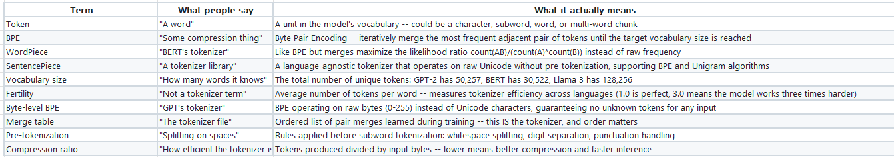

## Tokenizers: BPE, WordPiece, SentencePiece

LLMS are built on tokens not words. Tokens are not exactly words but can be called as pairs or group of characters put together based on a function like likelihood or frequency to keep the vocab size limited and convert language to numbers.

Considering the whole word as a token for all the words in a language will lead to huge cost due to millions of words similarly each character cannot be considered as a separate token. 
Hence techniques like <b>Subword tokenization<b> is done to make meaningful tokens and also keep the VOCAB_SIZE finite for a model.

### Byte Pair Tokenization (BPE)
BPE is a greedy compression algorithm repurposed for tokenization. The idea is simple. Combinining the characters occuring together until VOCAB_SIZE == Threshold

Start with individual characters. Count every adjacent pair in the training corpus. Merge the most commonly occuring pair into a new token. Repeat until you reach your target vocabulary size.

graph LR
    subgraph Training["BPE Training Loop"]
        direction TB
        T1["Start: character vocabulary"] --> T2["Count all adjacent pairs"]
        T2 --> T3["Merge most frequent pair"]
        T3 --> T4["Add merged token to vocab"]
        T4 --> T5{"Reached target\nvocab size?"}
        T5 -->|No| T2
        T5 -->|Yes| T6["Done: save merge table"]
    end

### WordPeice
This is similar to BPE but instead of frequency it uses <b>LIKELIHOOD<b>

Merge Criteria for a pair XY = count of (X and Y)  / (count(x) * count(Y))

### Sentence Piece 

It considers everything to be single string even spaces and special chars. it operates in BPE mode or unigram mode: BPE is bottom up approach and Unigram is top down approach. In unigram chars which effect the likelihood least are trimmed in each cycle until vocab size is reached/

## Problem of Multilinguality

The tokenizers of one language penalize the words of other languages heavily as they try to brak the words into simple words like unhappiness into un , happi and ness. 

Sennrich et al., 2016 -- "Neural Machine Translation of Rare Words with Subword Units" -- the paper that introduced BPE for NLP, turning a 1994 compression algorithm into the foundation of modern tokenization